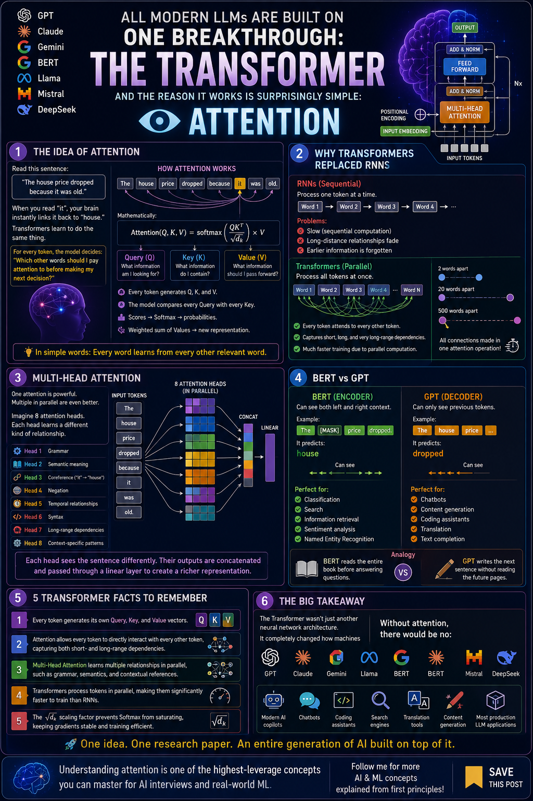

# Transformers & Attention Mechanisms

Today, I focused on the architecture behind modern large language models: the **Transformer**. I studied why Transformers replaced recurrent approaches for many sequence tasks, implemented the core architecture from scratch with PyTorch, and used pretrained models through Hugging Face.



## Learning objectives

- Understand why Transformers handle long-range dependencies better than RNNs.
- Learn how scaled dot-product attention uses queries, keys, and values.
- Understand multi-head attention and positional encoding.
- Build a Transformer encoder and text classifier with PyTorch.
- Compare encoder-only BERT with decoder-only GPT-style models.
- Use Hugging Face pipelines and pretrained BERT models.

## Why Transformers?

RNNs process a sequence one item at a time, making them difficult to parallelize and prone to losing information across long sequences. Transformers process all tokens together and allow each token to attend directly to other relevant tokens.

This makes Transformers highly parallelizable and effective at modeling long-range relationships. The architecture was introduced in the 2017 paper *Attention Is All You Need* by Vaswani et al.

## Concepts I learned

### 1. Scaled dot-product attention

Attention determines how strongly one token should focus on every other token.

$$
\text{Attention}(Q,K,V) = \text{softmax}\left(\frac{QK^T}{\sqrt{d_k}}\right)V
$$


- **Query (Q):** what the current token is looking for.
- **Key (K):** what each token can be matched against.
- **Value (V):** the information contributed by each token.
- **Scaling by $\sqrt{d_k}$:** prevents large dot products from making softmax overly peaked and gradients too small.
- **Softmax:** turns the scores into attention weights whose rows sum to 1.

A mask can set disallowed attention scores to negative infinity before softmax. This gives those positions a weight of zero, which is useful for preventing a decoder from seeing future tokens.

### 2. Multi-head attention

One attention head learns one representation of token relationships. Multi-head attention runs several heads in parallel using separate learned projections for Q, K, and V. Different heads can learn relationships such as syntax, semantic similarity, and pronoun references.

Each head uses:

$$
d_k = \frac{d_{model}}{n_{heads}}
$$

The head outputs are concatenated and passed through a final linear projection.

### 3. Positional encoding

Self-attention alone does not know token order. Positional encodings are added to token embeddings so the model can distinguish sentences such as “dog bites man” and “man bites dog.”

I implemented sinusoidal positional encoding using sine for even dimensions and cosine for odd dimensions. These varying frequencies give each sequence position a meaningful pattern.

### 4. Transformer encoder block

My encoder block contains:

1. Multi-head self-attention
2. Residual connection and layer normalization
3. Position-wise feed-forward network
4. A second residual connection and layer normalization
5. Dropout for regularization

The feed-forward network expands each token representation from `d_model` to `d_ff`, applies a ReLU activation, and projects it back to `d_model`.

### 5. BERT and GPT

| Feature | BERT | GPT-style models |
|---|---|---|
| Transformer component | Encoder only | Decoder only |
| Training objective | Masked-token prediction | Next-token prediction |
| Context direction | Bidirectional | Left to right (causal) |
| Best suited to | Understanding tasks | Generation tasks |
| Example uses | Classification, NER, extractive Q&A | Chat and text generation |

### 6. Important hyperparameters

| Hyperparameter | Meaning |
|---|---|
| `d_model` | Token embedding and hidden representation size |
| `n_heads` | Number of parallel attention heads |
| `n_layers` | Number of stacked Transformer blocks |
| `d_ff` | Hidden size of the feed-forward network |
| `max_seq_len` | Maximum supported sequence length |
| `vocab_size` | Number of tokens in the vocabulary |

## What I built

All implementation work is in [`Transformers_Attenstion_Mechanisms.ipynb`](./Transformers_Attenstion_Mechanisms.ipynb).

### Part A - Transformer components from scratch

Using PyTorch, I implemented:

- `scaled_dot_product_attention` with optional masking
- `MultiHeadAttention` with learned Q, K, V, and output projections
- sinusoidal `PositionalEncoding`
- `TransformerEncoderBlock` with attention, feed-forward layers, residual connections, normalization, and dropout
- `TransformerClassifier` for three-class text classification

The classifier embeds token IDs, adds positional information, sends them through two encoder blocks, applies global average pooling, and produces three class logits.

#### Verified result

```text
Parameters: 1,545,347
Output shape: torch.Size([4, 3])
```

The test used a batch of four sequences, each containing 64 token IDs. The `(4, 3)` output confirms that the model returns three class scores for every sample.

### Part B - Pretrained Transformers with Hugging Face

I also explored a production-oriented workflow:

- Ran a sentiment-analysis pipeline.
- Tokenized text with `bert-base-uncased`.
- extracted the BERT `[CLS]` representation as a sentence-level embedding.
- initialized `BertForSequenceClassification` for positive, negative, and neutral labels.
- configured AdamW with a learning rate of `2e-5` for fine-tuning.

#### Verified results

```text
Sentiment: POSITIVE
Confidence: 0.9986782670021057
CLS embedding shape: torch.Size([1, 768])
```

The new three-class classification layer is randomly initialized and must be trained on a labeled downstream dataset before it can make meaningful three-class predictions.

## Key takeaways

- Attention lets every token dynamically gather information from relevant tokens.
- Q, K, and V are learned projections, not fixed labels attached to words.
- Multi-head attention captures several kinds of relationships at the same time.
- Positional information is essential because attention itself is order-independent.
- Residual connections and layer normalization help deep Transformer networks train reliably.
- BERT is well suited to language-understanding tasks, while causal decoder models are designed for generation.
- Building attention from scratch develops architectural understanding; pretrained models are the practical starting point for most real applications.
- Loading a pretrained backbone does not train a newly added task-specific classification head.

## Knowledge check
1. What is the difference between self-attention and cross-attention?
2. Why is the attention score divided by $\sqrt{d_k}$?
3. Why does a Transformer need positional encoding?
4. What advantage does multi-head attention have over a single attention head?
5. For positive/negative/neutral headline classification, would BERT or a GPT-style model be the more natural starting point, and why?

<details>
<summary><strong>Answer key</strong></summary>


1. In self-attention, Q, K, and V come from the same sequence, so its tokens attend to one another. In cross-attention, the queries come from one sequence-usually the decoder-while the keys and values come from another sequence, such as the encoder output.
2. Dot products tend to grow as the key dimension increases. Dividing by $\sqrt{d_k}$ keeps their scale controlled, prevents softmax from becoming extremely peaked, and supports healthier gradients during training.
3. Self-attention considers relationships between tokens but has no built-in understanding of their order. Positional encoding adds sequence-position information to the embeddings, allowing the model to distinguish different word orders.
4. Multiple heads learn different projections and can focus on different relationships simultaneously, such as syntax, meaning, and coreference. Combining them gives the model a richer representation than one head alone.
5. BERT is the more natural starting point because it is an encoder trained to build bidirectional representations for language-understanding tasks. A three-class classification head can be added and fine-tuned on labeled headlines. A GPT-style model can also classify text, but its causal generation objective is less directly aligned with this task.

</details>


## Next step

Continue to Day 14: large language models, prompt engineering, few-shot learning, and practical LLM application patterns.
